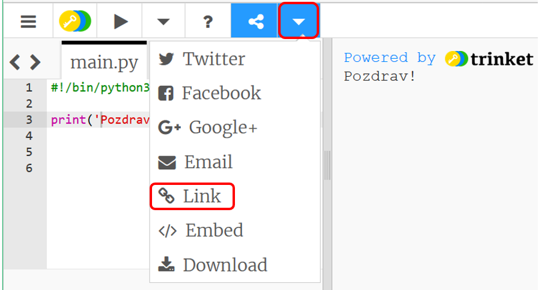

---
title: About Me
level: Python 1
language: hr
stylesheet: python
embeds: "*.png"
materials: ["project-resources/new/*.*", "volunteer-resources/about-me-finished/*.*"]
...

#Uvod:  { .intro}

U ovom projektu naučit ćeš napraviti program koji ljudima govori neke informacije o tebi.
 

  <iframe src="https://trinket.io/embed/python/a1f663ae0d?outputOnly=true&start=result" width="600" height="500" frameborder="0" marginwidth="0" marginheight="0" allowfullscreen>
  </iframe>
  

#Korak 1: POzdrav { .activity}

Počnimo pisanjem teksta.

## Zadatci { .check}

+ Otvori prazan Trinket predložak: <a href="http://jumpto.cc/python-new" target="_blank">jumpto.cc/python-new</a>. Čitaš li ovo online možeš koristiti ugrađenu verziju Trinketa koja se nalazi ispod ovog teksta. 

<iframe src="https://trinket.io/embed/python/33e5c3b81b?start=result" width="100%" height="400" frameborder="0" marginwidth="0" marginheight="0" allowfullscreen></iframe>

+ U prozor koji se pojavio upiši sljedeće: 

    

    Linija `#!/bin/python3` samo govori Trinket sučelju da koristimo Python 3 (zadnju inačicu).

+ Klikni na gumb 'Run' i vidjet ćeš da naredba `print()` ispisuje na zaslon sve što se nalazi između jednostrukih navodnika `''`.

    

+ Napraviš li pogrešku, dobit ćeš poruku o tome. 

    Isprobaj! Obriši završni navodnik `'` ili zatvorenu zagradu `)` (ili oboje) i provjeri što će se dogoditi. 

    

+ Vrati obrisani navodnik ili zagradu i klikni 'Run' da se uvjeriš da program ponovo radi ispravno. 

## Spremi projekt {.save}

__Ne trebaš imati Trinket račun za spremanje projekta!__ 

Ako nemaš Trinket račun, pritisni strelicu prema dolje i u padajućem izborniku odaberi naredbu 'Link'. Dobit ćeš link koji možeš spremiti i pomoću njega se kasnije vratiti u projekt. Taj postupak potrebno je ponoviti kod svake izmjene, jer se link mijenja. 

Imaš li Trinket račun možeš kliknuti na gumb 'remix' i napraviti svoju kopiju programa. 

## Izazov: O čemu razmišljaš? { .challenge}
Promijeni sljedeći kôd i ispiši neku zanimljivu činjenicu o sebi! 

## Spremi promjene u projektu {.save}

#Korak 2: ASCII umjetnost { .activity}

Ispišimo sada nešto zanimljivije od teksta... ASCII umjetnost! ASCII umjetnost stvara __slike iz teksta__.

## Zadatci { .check}

+ Dodajmo u program sliku psa!

    

+ Pokreneš li program, uočit ćeš da sadrži pogrešku. 

    

    To je zbog toga što tekst sadrži navodnik, što za Python znači da je na tome mjestu tekst završen. 

     

+ Da to popraviš, upiši `\` ispred navodnika u riječi il'. To govori Pythonu da je navodnik dio teksta.  

    

+ Također možeš koristiti tri navodnika `'''` umjesto jednog. Tako možeš pisati tekst u više redova, koristeći samo jednu `print` naredbu:

    

## Spremi promjene u projektu {.save}

## Izazov: Nešto o tebi { .challenge}
Napiši program u Pythonu u kojemu ćeš reći nešto o sebi. Koristi tekst i ASCII umjetnost. Možeš napraviti slike svojih hobija, prijatelja... ili bilo čega što ti se sviđa. 

__Ne zaboravi da je kôd koji pišeš u Trinket sučelju javan. Nemoj dijeliti osobne informacije kao što su tvoje ime ili adresa.__

Pogledaj primjer:

## Spremi promjene u projektu {.save}

#Korak 3: Godina 2025 { .activity}

Osim ispisa teksta, Python omogućuje i računanje te ispis brojeva. Otkrijmo koliko godina ćeš imati 2015. godine. 

## Zadatci { .check}

+ Da izračunaš koliko godina ćeš imati 2015. godine trebaš oduzeti godinu u kojoj si rođen od 2025. 
Dodaj sljedeće naredbe u svoj program:
   

    

    Primijeti da ne trebaš stavljati navodnike oko brojeva. 

    (Morat ćeš promijeniti broj `2006` ako si rođen(a) neke druge godine.)

+ Pokreni program naredbom 'Run' i ispisat će se koliko ćeš godina imati 2025. godine.  

    

+ Možeš poboljšati program koristeći naredbu `input()`. Ona će ti omogućiti da pitaš korisnika koje je godine rođen i taj podatak spremiš u  __varijablu__ nazvanu `rodjen`.

    

+ Pokreni program i unesi godinu svog rođenja. Dobiješ li poruku o pogrešci? 

    To je zbog činjenice da je sve što unosiš u program __tekst__ i taj je tekst potrebno pretvoriti u __broj__.

    Za pretvorbu teksta u __cijeli broj__ možeš koristiti `int()`  ('int' označava 'integer' - što na engleskom označava 'cijeli broj').

    

+ Također možeš napraviti novu varijablu u koju ćeš spremiti rezultat i onda ispisati njezinu vrijednost. 

    

+ Na kraju, program možeš napraviti razumljivijim korisniku dodajući poruku. 

    

## Spremi promjene u projektu {.save}

## Izazov: Tvoja starost u psećim godinama { .challenge}
Napravi program koji će pitati korisnika koliko ima godina i reći mu koliko bi to bilo u psećim godinama. To ćeš izračunati tako da uneseni broj godina pomnožiš sa 7. 

U programiranju, simbol za __množenje__ je `*`.

## Spremi promjene u projektu {.save}

## Izazov: Računanje s tekstom { .challenge}

Znaš li da možeš računati i s tekstualnim podatcima? Što će sljedeći program ispisati na zaslon? Provjeri možeš li točno odgovoriti na to pitanje prije pokretanja programa.

Možeš li upotrijebiti neke svoje riječi? Možeš napraviti čak i svoje vlastite uzorke.

## Spremi projekt {.save}

